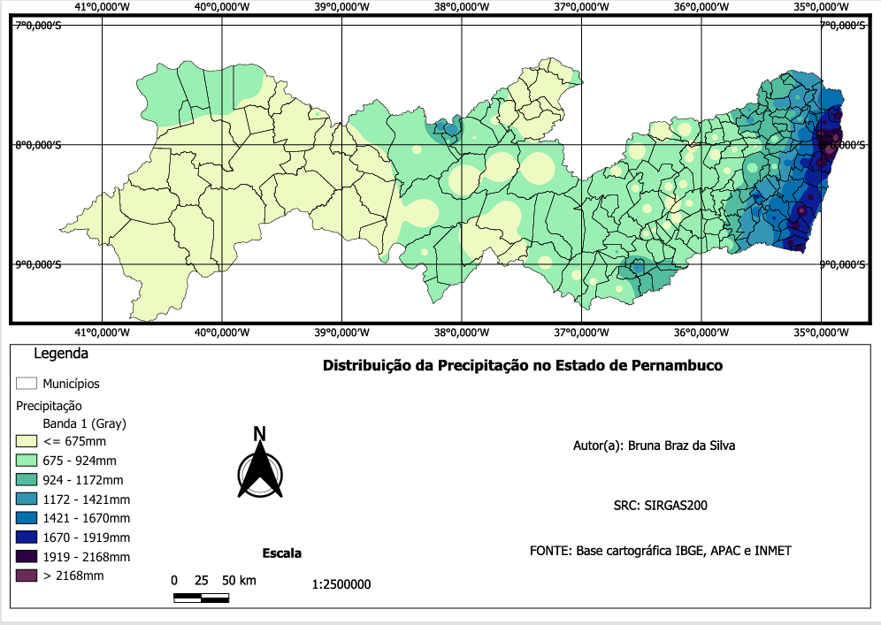
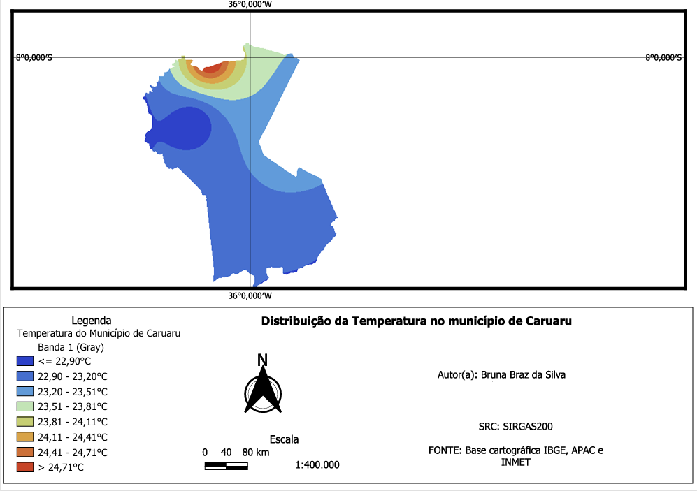
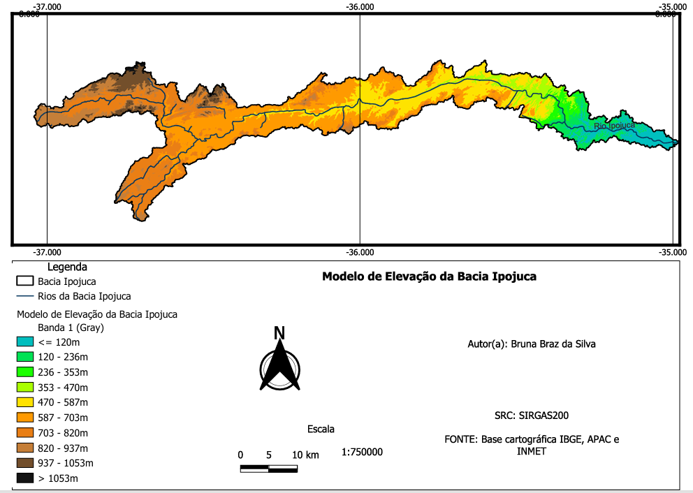

# Análise Climática e Topográfica do Estado de Pernambuco

Este projeto foi desenvolvido utilizando o software QGIS, com foco na análise espacial de dados climáticos e topográficos no estado de Pernambuco, com destaque para o recorte da **bacia hidrográfica do Rio Ipojuca** e do **município de Caruaru**.

## Objetivo

- Organizar e pré-processar os dados climáticos e de relevo.
- Criar mapas temáticos de precipitação e temperatura (média, máxima e mínima anual).
- Realizar recortes espaciais para a bacia do Rio Ipojuca e o município de Caruaru.
- Analisar o Modelo Digital de Elevação (MDE) em diferentes recortes territoriais.

## Estrutura do Projeto

analise-climatica-pe/ │ ├── dados/ │ ├── shapefiles/ # Arquivos vetoriais: estados, municípios, bacias │ ├── mde/ # Arquivos raster (Modelo Digital de Elevação) │ └── outros_arquivos/ # Outros dados auxiliares │ ├── projetos_qgis/ # Projetos do QGIS (.qgz) │ ├── analise_climatica.qgz │ └── analise_mde.qgz │ └── README.md

## Ferramentas Utilizadas

- [QGIS 3.x](https://qgis.org)
- Dados de precipitação e temperatura (fontes públicas)
- Modelo Digital de Elevação (MDE)

## Etapas do Projeto

### 1. Pré-processamento dos dados
- Organização da pasta com shapefiles do estado de Pernambuco, municípios e bacias hidrográficas.

### 2. Análise Climática
- Elaboração de mapas temáticos:
  - Precipitação anual
  - Temperatura média, máxima e mínima anual
- Recorte específico da bacia hidrográfica do Rio Ipojuca
- Recorte específico do município de Caruaru

### 3. Análise do MDE
- Geração do MDE para o estado de Pernambuco
- Recorte do MDE para:
  - A bacia do Rio Ipojuca
  - O município de Caruaru

## Exemplos de Mapas Gerados

###  Mapa de Precipitação - Estado de Pernambuco

###  Mapa de Temperatura Média - Município de Caruaru

###  Mapa de Elevação (MDE) - Bacia Hidrográfica do Rio Ipojuca

## Autor(a)

Este projeto foi desenvolvido como parte de uma atividade prática envolvendo geoprocessamento e análise espacial com QGIS.
